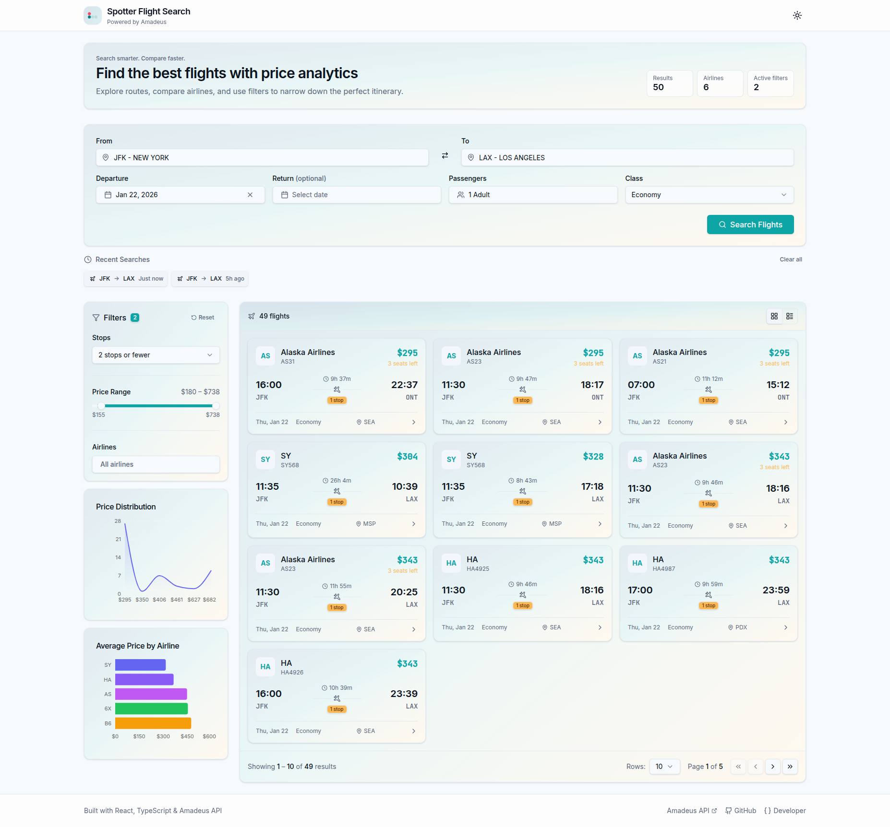

# Flight Search & Analytics Web App

A modern, professional Flight Search Engine built with React, TypeScript, and the Amadeus API. Designed with enterprise-grade UX inspired by Spotter.ai's design philosophy: calm, confident, and analytical.



## 🚀 Features

### Core Features
- **Flight Search** - Search flights with autocomplete airport input, date selection, and passenger configuration
- **Advanced Data Table** - Powered by TanStack Table with:
  - Client-side sorting
  - Pagination with customizable page size
  - Column visibility toggle (persisted to localStorage)
  - Column resizing
  - Loading skeletons
  - Empty and error states
- **Live Price Analytics** - Real-time charts that update when filters change:
  - Price distribution chart
  - Airlines price comparison
- **Complex Filtering** - Simultaneous filters that update both table and charts:
  - Airlines (multi-select)
  - Number of stops
  - Price range (dual slider)

### Bonus Features
- ✅ **Dark Mode** - System preference detection with manual toggle
- ✅ **Persistent Table Layout** - Column visibility saved to localStorage
- ✅ **Column Visibility Toggle** - Show/hide columns as needed
- ✅ **URL-based Filters** - Shareable filter state via URL params
- ✅ **Recent Searches** - Quick access to previous searches

### UX Enhancements
- Smooth animations and transitions
- Keyboard-friendly navigation
- Inline form validation
- Responsive design (mobile-first)
- Professional monospaced price formatting
- Subtle row hover effects

## 🛠️ Tech Stack

| Category | Technology |
|----------|------------|
| Framework | React 19 + Vite |
| Language | TypeScript |
| UI Library | shadcn/ui (Radix UI primitives) |
| Styling | Tailwind CSS v4 |
| Icons | Lucide React |
| Charts | Recharts |
| Tables | TanStack React Table v8 |
| State | React Hooks + Context |
| API | Amadeus Self-Service API |
| Linting | ESLint + Prettier |

## 📁 Project Structure

```
src/
├── components/
│   ├── Charts/           # Price distribution and airline charts
│   ├── DataTable/        # TanStack Table implementation
│   ├── Filters/          # Filter components (airline, stops, price)
│   ├── Layout/           # Header and Footer
│   ├── Search/           # Search form and airport autocomplete
│   └── ui/               # shadcn/ui base components
├── contexts/             # React Context providers
│   ├── SearchContext.tsx # Search state management
│   └── ThemeContext.tsx  # Dark mode support
├── hooks/                # Custom React hooks
│   ├── useDebounce.ts
│   ├── useFilters.ts
│   └── useLocalStorage.ts
├── pages/                # Page components
│   └── Dashboard.tsx     # Main dashboard
├── services/             # API layer
│   └── amadeus.ts        # Amadeus API integration
├── types/                # TypeScript definitions
│   └── flight.ts
└── utils/                # Utility functions
    ├── constants.ts      # App constants
    ├── formatters.ts     # Date/price formatting
    └── validators.ts     # Input validation
```

## 🎨 Design System

### Color Palette (Spotter.ai Inspired)

| Role | Light | Dark |
|------|-------|------|
| Background | `#F8FAFC` | `#0F172A` |
| Card | `#FFFFFF` | `#1E293B` |
| Primary | `#1E293B` | `#F1F5F9` |
| Accent | `#6366F1` | `#818CF8` |
| Success | `#22C55E` | `#4ADE80` |
| Warning | `#F59E0B` | `#FBBF24` |

### Typography
- **Sans-serif**: Inter (Google Fonts)
- **Monospace**: JetBrains Mono (for prices)

## 🏃 Getting Started

### Prerequisites
- Node.js 18+
- npm or yarn
- Amadeus API credentials (free test account)

### Installation

1. **Clone the repository**
   ```bash
   git clone <repository-url>
   cd flight-search-engine
   ```

2. **Install dependencies**
   ```bash
   npm install
   ```

3. **Configure environment**
   ```bash
   cp .env.example .env
   ```
   
   Add your Amadeus API credentials:
   ```env
   VITE_AMADEUS_API_KEY=your_api_key
   VITE_AMADEUS_API_SECRET=your_api_secret
   ```
   
   Get your credentials at: https://developers.amadeus.com/

4. **Start development server**
   ```bash
   npm run dev
   ```

5. **Open in browser**
   ```
   http://localhost:5173
   ```

### Build for Production

```bash
npm run build
npm run preview
```

## 📖 Architecture Decisions

### Why TanStack Table?
- Headless UI allows complete styling control
- Built-in support for sorting, pagination, column visibility
- TypeScript-first API
- Zero dependencies beyond React

### Why Recharts?
- Declarative SVG charts
- Responsive containers
- Smooth animations
- Easy customization with CSS

### Why Context over Redux?
- Simpler mental model for this scale
- No action boilerplate
- Built into React (no dependencies)
- Sufficient for local state management

### Why Debounced Filters?
- Prevents excessive re-renders
- Smoother UX when using sliders
- Reduces API calls for server-side filtering

## 🧪 Testing

```bash
# Lint check
npm run lint

# Type check
npm run type-check

# Build verification
npm run build
```

## 🌐 Deployment

The app is ready for deployment to any static hosting:

```bash
# Deploy to Vercel
npx vercel

# Deploy to Netlify
npx netlify deploy --prod --dir=dist
```

**Environment Variables**: Make sure to set `VITE_AMADEUS_API_KEY` and `VITE_AMADEUS_API_SECRET` in your hosting platform's environment settings.

## 📝 License

MIT License - feel free to use this for learning or as a starting point for your own projects.

---

Built with ❤️ using React, TypeScript, and modern web technologies.
